**1. Introduction**

**1.1 Problem Statement**

This project aims to analyze how different transaction factors influence
the likelihood of fraud.

**1.2 Dataset**

**1.2.1 Dataset Source: **

[[https://github.com/VineetKumar711/creditcardfraud/tree/main]{.underline}](https://github.com/VineetKumar711/creditcardfraud/tree/main)

**1.2.2 Dataset Description:**

The Credit Card Fraud Dataset is a publicly available dataset containing
transactional records spanning seven months, from June to December. It
consists of multiple CSV files representing monthly transaction data,
along with a separate file identifying fraudulent transactions. The
dataset captures a wide range of attributes that provide valuable
insights into financial activities, including transaction details
(timestamp, transaction amount, merchant information, transaction
category, and unique transaction identifiers), cardholder demographics
(name, gender, address, city, state, and date of birth), and geospatial
data (latitude and longitude of both the cardholder and merchant).
Additionally, it includes city population and cardholder job title,
which may contribute to fraud risk assessment. The fraud dataset
specifically contains an is_fraud column, indicating whether a
transaction is fraudulent (1) or legitimate (0). By merging the
transaction and fraud datasets, we obtain a comprehensive dataset with
555,719 transactions and 23 attributes, enabling an in-depth analysis of
transaction patterns and fraud detection.

**1.3 Tools**

To analyze our dataset and generate our report, we utilized the
following tools and techniques:

-   Unzip tools were used to extract one of the transaction data from a
    compressed .zip file.

-   Python was used for data cleaning, exploratory data analysis, data
    preprocessing and feature engineering。

**1.4 Why Analyze this Dataset**

Analyzing this dataset is essential for understanding transaction trends
and identifying key factors associated with fraudulent activity. Through
data cleaning, exploratory data analysis (EDA), data preprocessing, and
feature engineering, we can uncover patterns in transaction behavior and
detect significant trends. EDA allows us to visualize transaction
distributions, spot anomalies, and identify relationships between
variables, while feature engineering helps refine the dataset for
further modeling. By focusing on these steps, we aim to extract
meaningful insights that can guide future fraud detection efforts and
enhance data-driven decision-making.

**2. Objectives**

**2.1 Data Cleaning and Handling Inconsistencies**

Firstly, a fraud dataset and six individual monthly transaction datasets
from June to December are loaded individually, with each dataset
containing transactional records. These datasets are then combined into
a single unified dataset through concatenation. A merging operation is
performed with the fraud dataset using a left join on the transaction
ID, incorporating an indicator variable that designates whether each
transaction is fraudulent or legitimate. Then, the shape of the merged
data frame is (555719, 23) which means that there are 555719 rows and 23
columns.

A series of data cleaning steps were performed to ensure data integrity
and consistency. First, duplicate records were checked and removed, but
no duplicates were found. Next, missing values across multiple columns,
including merchant, category, last name, street, and job, were
identified and subsequently dropped to maintain data completeness. After
dropping the missing value, the shape of the data frame becomes
(555624,23). The dataset was then reset to ensure proper indexing. The
number of unique values per column was analyzed to understand
variability in attributes such as transaction ID, merchant, category,
and customer demographics. State values were converted to uppercase,
reducing the number of unique state entries from 96 to 50, ensuring
consistency. Gender labels were standardized by replacing \"Male\" and
\"Female\" with \"M\" and \"F\".

A box plot was generated to visualize transaction amounts, revealing the
presence of outliers.

```{r}
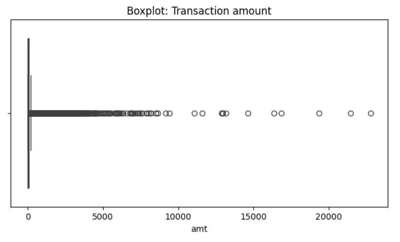
```

The box plot of transaction amounts reveals a right-skewed distribution
with a significant number of high-value outliers, indicating that most
transactions are of relatively small amounts while a few extend beyond
\$5,000, \$10,000, and even \$20,000. The presence of numerous outliers
suggests that large transactions are uncommon and may warrant further
investigation, particularly in the context of fraud detection. Since
fraudulent activities often involve unusually high transaction amounts,
these outliers could serve as potential fraud indicators. Additionally,
the interquartile range (IQR) method identified an upper bound of
approximately \$266.96, suggesting that most transactions fall within
this range, while those exceeding this threshold might be considered
suspicious. 

Therefore, given the unique characteristics of fraud detection, where
fraudulent transactions often involve unusually high amounts, these
outliers hold valuable information. Removing them could lead to the loss
of critical fraud indicators, potentially reducing the effectiveness of
exploratory data analysis and future fraud detection models. Thus, the
decision was made not to remove these outliers, allowing for a more
comprehensive analysis of transaction patterns and anomalies.

**2.2 Exploratory Data Analysis**

Important details about the dataset\'s numerical characteristics are
disclosed by the summary statistics. There is substantial variation in
the transaction values, as seen by the transaction amount\'s (amt) large
standard deviation of \$156.75 and mean of \$69.39. The existence of
high-value transactions is further supported by the maximum transaction
amount of \$22,768.11. Both cardholders\' and merchants\' latitude and
longitude data indicate that transactions take place over a large
geographic region. The wide range of city populations---from 23 to over
2.9 million---indicates that transactions take place in both urban and
rural areas.

With 99.61% of transactions being genuine and just 0.39% being
categorized as fraudulent, the class distribution of fraudulent
transactions (is_fraud) shows a significant class imbalance. This
disparity implies that in order to enhance fraud classification
performance, fraud detection models would need to employ strategies like
oversampling, undersampling, or synthetic data synthesis. Reducing false
negatives and guaranteeing efficient fraud detection depend on
addressing this mismatch.

```{r}
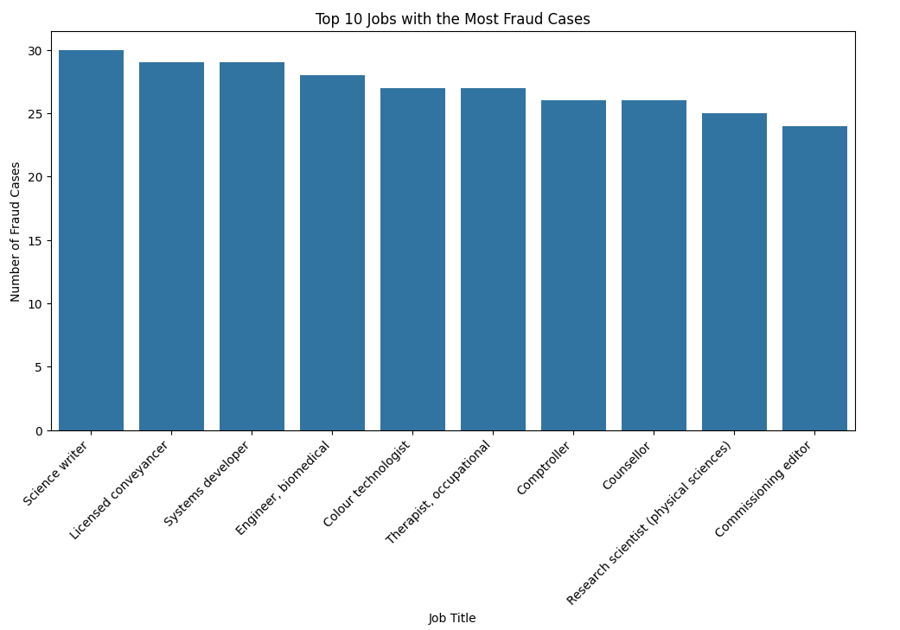
```

The pie charts illustrate the distribution of transactions by gender for
both fraudulent and non-fraudulent transactions. In both cases, the
proportions of female and male cardholders are relatively similar, with
females accounting for approximately 54.9% of non-fraudulent
transactions and 54.3% of fraudulent transactions, while males represent
45.1% and 45.7%, respectively. This suggests that fraudulent
transactions do not appear to be strongly associated with gender, as the
distribution remains consistent between fraudulent and legitimate
transactions. Therefore, gender may not be a significant distinguishing
factor for fraud detection. However, further analysis is needed to
assess whether other factors, such as transaction amount or location,
play a more critical role in fraudulent activity.

```{r}
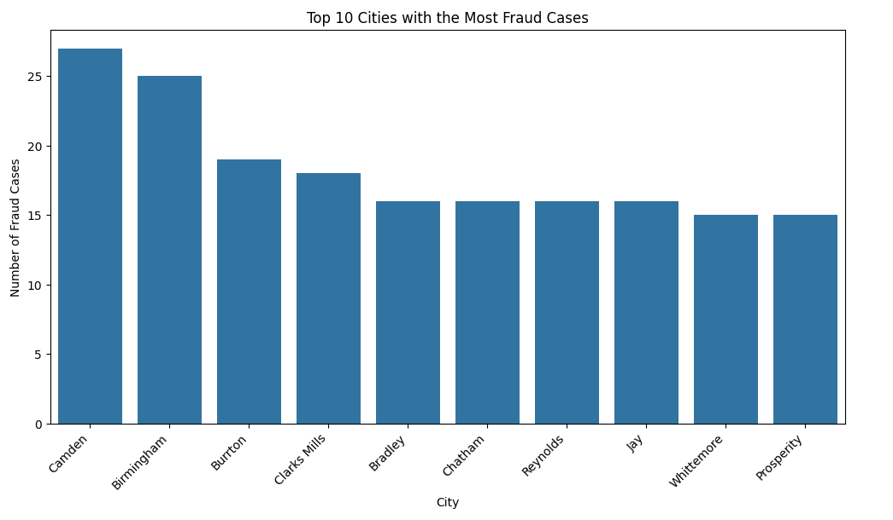
```


The examination of fraudulent transactions by job title reveals
noticeable outliers, with certain occupations experiencing significantly
higher fraud rates. Jobs such as Science Writer (30 cases), Licensed
Conveyancer (29 cases), Systems Developer (29 cases), and Biomedical
Engineer (28 cases) have a disproportionately high number of fraudulent
transactions compared to other professions. Identified as outliers using
the Interquartile Range (IQR) method, these job titles suggest that
individuals in these roles may be targeted more frequently or exhibit
transaction patterns that increase their likelihood of being flagged as
fraudulent. The bar chart further illustrates the top 10 job titles
associated with fraud, reinforcing the prominence of these occupations
in fraudulent transactions. This trend raises the question of whether
certain job titles are inherently more prone to fraud or if external
factors contribute to their overrepresentation. Further analysis is
needed to assess whether job titles serve as a meaningful predictor of
fraudulent activity or if the observed pattern is due to data
distribution biases.

```{r}
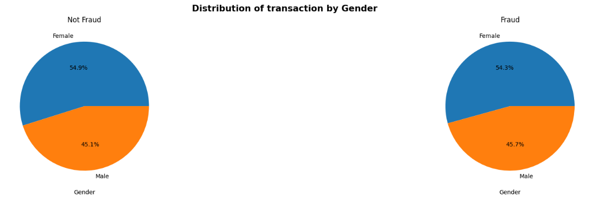
```

The analysis examines the distribution of fraudulent transactions across
different cities by identifying outlier cities using the Interquartile
Range (IQR) method. The results indicate that Camden (27 cases),
Birmingham (25 cases), and Burrton (19 cases) exhibit significantly
higher fraud occurrences compared to other cities, classifying them as
fraud hotspots. A bar chart displaying the top 10 cities with the most
fraud cases further highlights these locations, suggesting that certain
geographic areas may be more prone to fraudulent activities. Further
investigation is necessary to determine whether these cities are
inherently high-risk for fraud.

```{r}
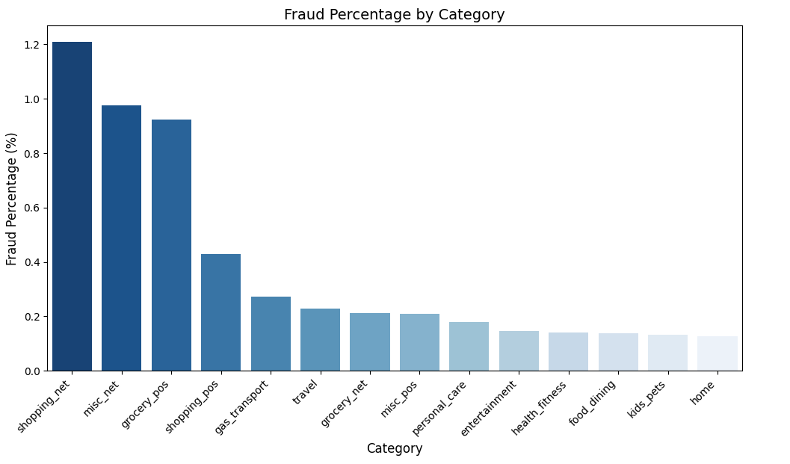
```

The bar chart presents the fraud percentage by transaction category,
calculated as the proportion of fraudulent transactions within each
category. The highest fraud percentages are observed in shopping_net,
misc_net, and grocery_pos, each exceeding 1% fraud occurrence relative
to total transactions in their respective categories. Shopping_pos,
gas_transport, and travel also show noticeable fraud rates, albeit lower
than the top categories. Other categories, such as personal_care,
entertainment, and health_fitness, have comparatively lower fraud
percentages.

```{r}
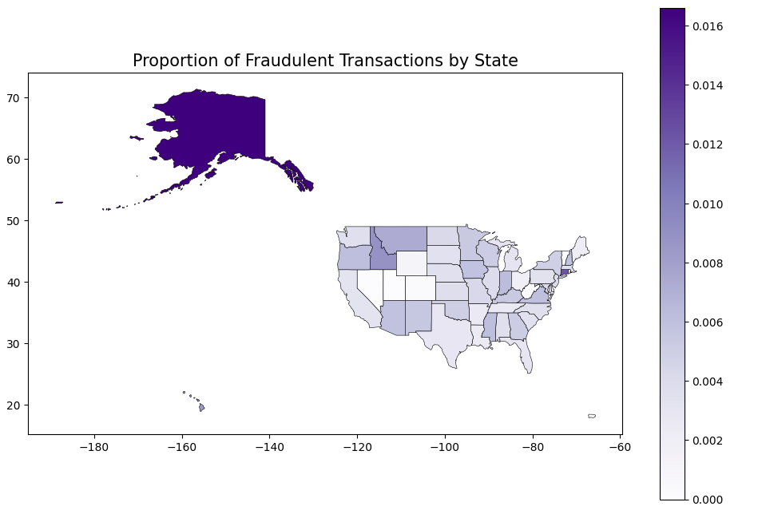
```

The choropleth map displays the proportion of fraudulent transactions by
state, illustrating the relative fraud rates rather than absolute
transaction counts. The darker shades indicate a higher proportion of
fraudulent transactions relative to total transactions within each
state. Alaska exhibits the highest fraud proportion, significantly
darker than other states, suggesting that a larger fraction of
transactions in Alaska are fraudulent. Other states with higher fraud
proportions include Connecticut, Idaho, Montana and Oregon while several
states remain light-colored, indicating a lower proportion of fraudulent
transactions. This visualization helps identify regions where fraudulent
transactions make up a greater share of overall transactions.

**2.3 Data Preprocessing and Feature Engineering**

Through data preprocessing and feature engineering, we've transformed
the raw dataset into a clean, structured format ready for analysis and
modeling. The dataset includes details like transaction times, amounts,
merchant information, and customer demographics. Our goal is to identify
fraudulent transactions, which are labeled in the data. To prepare the
dataset for analysis, we performed several preprocessing tasks, such as
handling datetime features, creating new features, encoding categorical
variables, and balancing the dataset. 

**2.3.1 Data Preprocessing**

**2.3.1.1 Handling Datetime Features**

The dataset includes a column called **trans_date_trans_time**, which
originally stored dates and times as strings. To make this data easier
to work with, we converted it into a datetime format. We then split this
column into two separate columns: trans_date and trans_time. This
allowed us to analyze the data more granularly. Additionally, we created
several new features:

-   **trans_time_group**: This captures the hour of the transaction,
    helping us analyze patterns based on the time of day.

-   **trans_month**: This identifies the month of the transaction, which
    can help identify seasonal trends.

-   **trans_dayOfWeek**: This identifies the day of the week, helps us
    to study weekly patterns.

```{r}
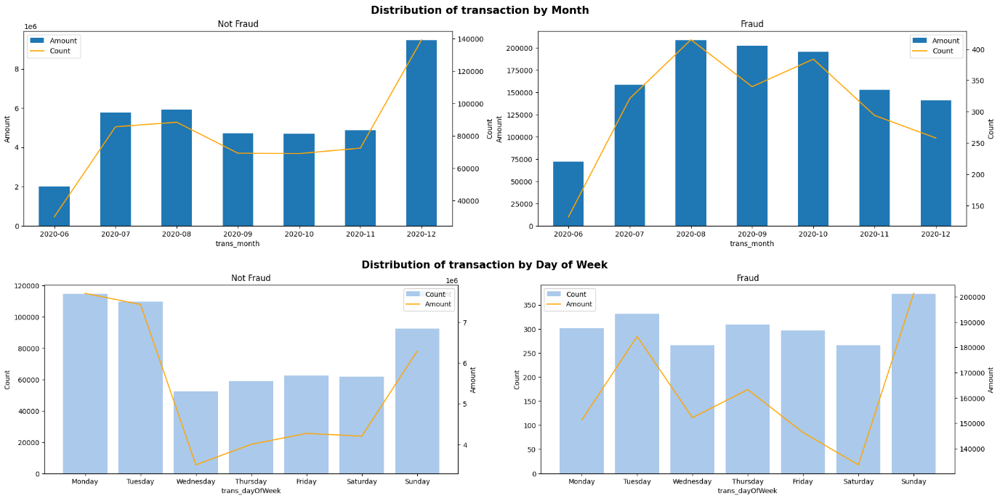
```

The monthly distribution of transactions shows that non-fraudulent
transactions remain relatively stable throughout the year, with a
noticeable increase in December. In contrast, fraudulent transactions
peak between July and October, before gradually declining toward the end
of the year. This fluctuation suggests that fraud activity may follow
seasonal trends, differing from the more consistent spending behavior
observed in legitimate transactions. 

The key differences between fraudulent and non-fraudulent operations are
highlighted by the distribution of transactions by day of the week.
Monday and Tuesday saw the highest number of non-fraudulent
transactions, followed by a sharp decline on Wednesday and a slow rise
on Sunday. On the other hand, fraudulent transactions seem to be spread
out more equally throughout the week, with noticeable increases on
Tuesday and Sunday. This disparity implies that fraudulent transactions
deviate from normal customer purchasing patterns, which may point to
deliberate timing on the part of fraudsters.

**2.3.1.2 Handling Customer Demographics**

The dataset includes a **dob** (date of birth) column, which we
converted into a datetime format. From this, we calculated each
customer's age. To make the age data more useful, we grouped customers
into categories like \"**Minors**,\" \"**Young Adults**,\"
\"**Adults**,\" \"**Mature Adults**,\" and \"**Seniors**.\" This helps
us analyze how fraud might vary across different age groups.

```{r}
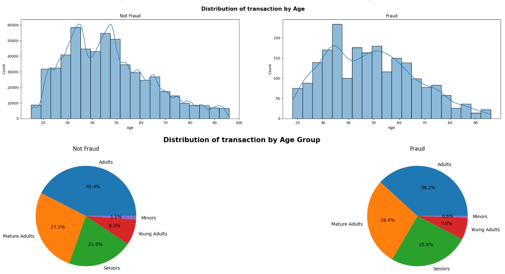
```

The age distribution analysis indicates that both fraudulent and
non-fraudulent transactions follow a similar pattern, with the highest
transaction volumes occurring among individuals aged 30 to 50. While
there are slight variations, such as a marginally higher concentration
of fraud cases in the 30 to 40 age range, the overall distribution
remains consistent, which means that age may not be a strong
distinguishing factor in fraud detection. The age group distribution
further supports this observation, as the proportions of fraudulent and
non-fraudulent transactions across different age groups are relatively
similar. Although there are minor differences, such as a slightly higher
percentage of fraudulent transactions among mature adults and seniors,
the variations are not substantial.

**2.3.1.3 Creating New Features**

We created several new features to better understand the data:

-   **full_name**: We combined the first and last name columns to create
    a full name for each customer.

-   **time_diff**: This calculates the time difference between
    consecutive transactions for each customer, which can help identify
    unusual patterns.

-   **time_window**: We categorized the time differences into predefined
    windows (e.g., \"10 min,\" \"1 hour,\" \"24 hours\") to analyze how
    frequently transactions occur within certain timeframes.

**2.3.1.4 Dropping Irrelevant Columns**

To streamline the dataset, we removed columns that weren't relevant to
our analysis. These included zip, trans_num, unix_time, merch_lat,
merch_long, and others. This step helps reduce noise and focus on the
most important features.

**2.3.2 Feature Engineering**

**2.3.2.1 Balancing the Dataset**

The dataset was highly imbalanced, with far fewer fraudulent
transactions than legitimate ones. To address this, we created a
balanced subsample by combining all fraudulent transactions with an
equal number of randomly selected non-fraudulent transactions. This
ensures our model isn't biased toward the majority class.

**2.3.2.2 Encoding Categorical Variables**

Categorical variables like gender, job, state, street, merchant, city,
category, trans_dayOfWeek, and time_window were encoded to make them
suitable for machine learning models. We used one-hot encoding for the
gender column and target encoding for the other categorical variables.

**2.3.2.3 Correlation Analysis**

We performed a correlation analysis to identify which features have a
strong relationship with the target variable (**is_fraud**).

```{r}
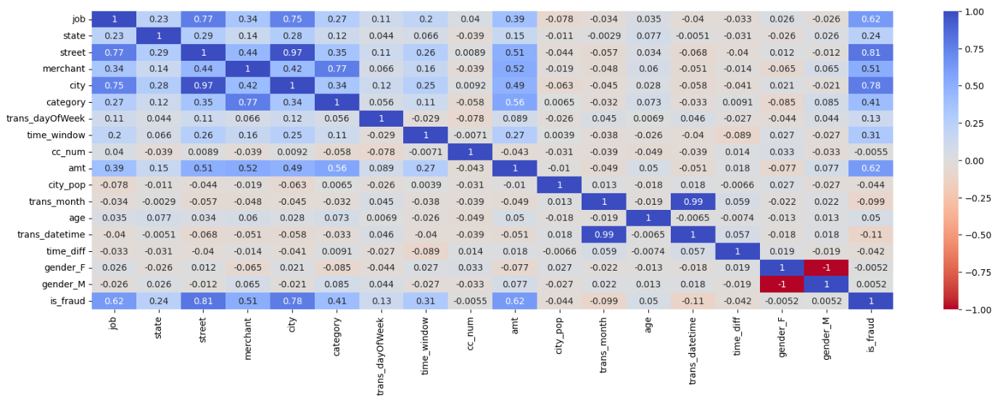
```

The correlation heatmap shows that job (0.62), street (0.81), merchant
(0.51), city (0.78), category (0.41), and transaction amount (0.62) have
the strongest associations with fraud.

Features with a correlation greater than 0.1 were considered relevant
for modeling.

```{r}
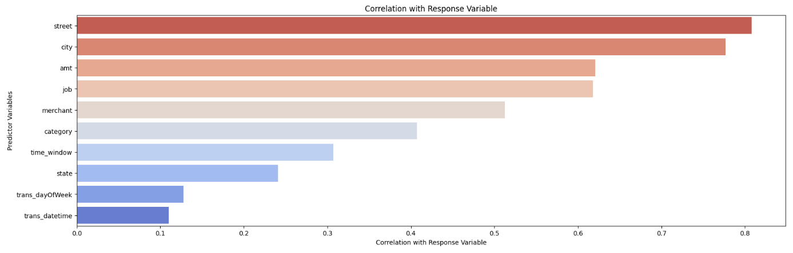
```

The bar chart highlights the variables most correlated with fraudulent
transactions. The strongest predictors include street, city, transaction
amount, job, merchant, and category, indicating that location and
transaction details play a key role in fraud detection. Other features,
such as time window, state, day of the week, and transaction timestamp,
show weaker correlations but may still contribute to fraud
identification. These insights suggest that fraud detection models
should prioritize location-based attributes and transaction details for
better predictive accuracy.

**2.3.2.4 Visualizing Feature Distributions**

To better understand the data, we visualized the distributions of key
features like **street, city, amt, job, merchant, category, time_window,
state, and trans_dayOfWeek** for fraudulent transactions. These
visualizations help us spot patterns and anomalies that could be useful
for fraud detection.

```{r}
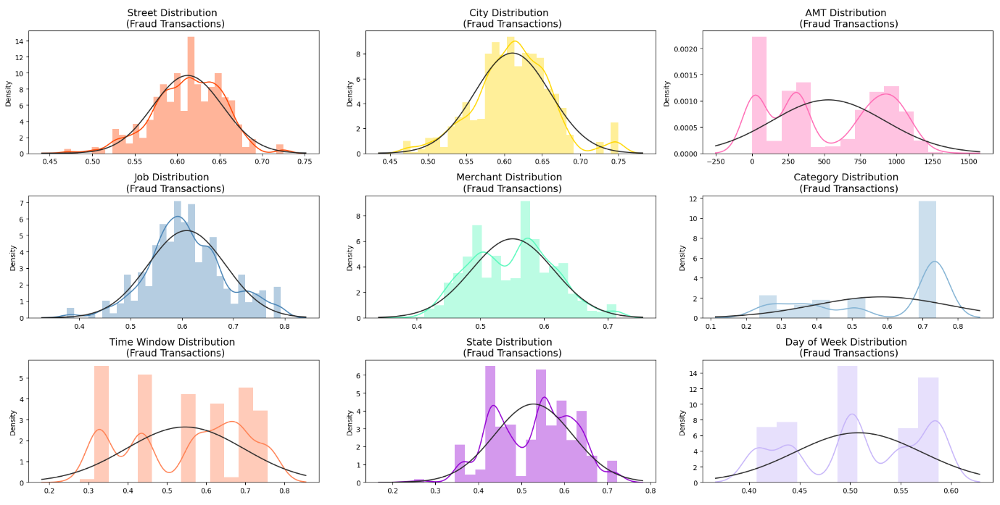
```

The distribution plots illustrate the density of fraudulent transactions
across key predictor variables.

-   **Street, City, and Merchant** variables follow a relatively normal
    distribution, indicating that fraud occurs across a broad range of
    locations and merchants without extreme skewness.

-   **Transaction amount** shows a multimodal distribution, suggesting
    that fraudulent transactions are more frequent at specific price
    points rather than being evenly distributed.

-   **Job and Category** distributions also exhibit normal-like
    behavior, implying that fraud is spread across multiple professions
    and transaction types rather than concentrated in specific ones.

-   **Time Window and Day of the Week** distributions reveal notable
    variations, indicating that fraud occurs at different time intervals
    and is not evenly spread across all days.

-   **State distribution** varies significantly, with certain states
    exhibiting higher fraud density.

**3. Summary of Key Findings**

1.  **Location-Based Features Show Strong Predictive Power**

    -   The correlation bar chart shows that *street* and *city* have
        the highest correlation with fraud, surpassing even transaction
        amounts. This shows that certain addresses or geographic
        patterns may be particularly indicative of fraudulent activity.

2.  **Transaction Amount (amt) is a Critical Indicator**

    -   While many fraudulent transactions cluster around lower amounts,
        the distribution plot shows a noticeable tail extending toward
        higher amounts. This shows that fraud can occur at both small
        and large transaction values.

3.  **Time-Related Observations**

    -   **Monthly Trends:** Fraudulent transactions exhibit a slight
        uptick in certain months (e.g., around September or October),
        indicating that fraudsters may take advantage of seasonal or
        periodic factors.

    -   **Day of Week Patterns:** Both fraudulent and non-fraudulent
        transactions peak toward the end of the workweek (especially on
        Fridays), suggesting higher transaction volume---and
        consequently higher fraud potential---leading into the weekend.

4.  **Categorical Features and Target Encoding**

    -   Features like *job*, *merchant*, *category*, and *time_window*
        (the interval between consecutive transactions) also show
        meaningful correlations with fraud. The distribution plots show
        that while these encoded values cluster in certain ranges, there
        is variability indicating no single category is exclusively
        fraudulent and multiple factors interplay.

5.  **Imbalanced Nature of the Dataset**

    -   The overall data distribution was highly skewed toward
        non-fraudulent transactions. As a result, balancing techniques
        are important to ensure that models learn from both classes
        effectively.

**4. Challenges Faced and Future Recommendations**

**4.1 Challenges Faced**

1.  Imbalanced Dataset:

    -   The dataset was highly imbalanced, with fraudulent transactions
        making up a very small percentage of the total transactions.
        This imbalance can lead to models that are biased toward the
        majority class (non-fraudulent transactions), making it
        difficult to accurately detect fraud.

    -   **Solution**: We addressed this by creating a balanced
        subsample.

2.  Handling Datetime Features:

    -   The **trans_date_trans_time** column required careful handling
        to extract meaningful features like **trans_time_group,
        trans_month, and trans_dayOfWeek**. Ensuring consistency in
        datetime formatting and handling time zone differences was a
        challenge.

    -   **Solution**: We standardized the datetime format and derived
        relevant features.

3.  High Dimensionality After Encoding:

    -   Encoding categorical variables like job, state, city, and
        category using one-hot encoding and target encoding increased
        the dimensionality of the dataset. This can lead to
        computational inefficiency and overfitting.

    -   **Solution**: We used target encoding to reduce dimensionality.

4.  Identifying Relevant Features:

    -   With a large number of features, identifying the most relevant
        ones for fraud detection was challenging. Some features had weak
        correlations with the target variable, making it difficult to
        determine their importance.

    -   **Solution**: We used correlation analysis to filter features
        with a correlation greater than 0.1.

5.  Missing or Inconsistent Data:

    -   The dataset had missing or inconsistent values in some columns
        (e.g., dob, street, city), which required careful handling to
        avoid introducing bias or errors into the analysis.

    -   **Solution**: We dropped irrelevant columns and handled missing
        values.

**4.2 Future Recommendations**

> **Deeper Feature Exploration:**
>
> It would be beneficial to further explore the nuances of customer
> behavior. For instance, looking at patterns over longer time periods
> or combining transaction details in new ways might reveal hidden
> signals that differentiate normal activity from fraudulent behavior.
>
> **Enhanced Data Balancing Methods:**
>
> While our current approach balances the dataset by undersampling
> non-fraudulent transactions, exploring techniques like SMOTE
> (Synthetic Minority Over-sampling Technique) might help us retain more
> information from the non-fraudulent side while still addressing the
> imbalance effectively.
>
> **Implementing machine learning models:**
>
> Implementing machine learning models can improve fraud detection
> accuracy. Decision Trees provide interpretability, while Random Forest
> reduces overfitting using multiple trees. Gradient Boosting (XGBoost,
> LightGBM) enhances predictive accuracy, and SVM effectively separates
> fraud from legitimate transactions. Evaluating models with precision,
> recall, F1-score, and AUC-ROC, and optimizing with hyperparameter
> tuning can further enhance detection performance.

**6. Member's contribution and GitHub repository**

Zhuoxuan Li \<zl3429\> -- Data Cleaning and Handling Inconsistencies,
Report Preparation\
Ziyue Gao \<zg2520\> -- Exploratory Data Analysis (EDA), Report
Preparation\
Dailin Song \<ds4354\> -- Data Preprocessing and Feature Engineering,
Report Preparation\
Fatih Uysal \<fu2137\> -- Data Preprocessing and Feature Engineering,
Report Preparation

For Data Acquisition, each member searched for different datasets, and
then, as a team, we decided on one of them.

**GitHub Repository:**
[[https://github.com/zhuoxuan3429/5243Team2_Project1.git]{.underline}](https://github.com/zhuoxuan3429/5243Team2_Project1.git) 

